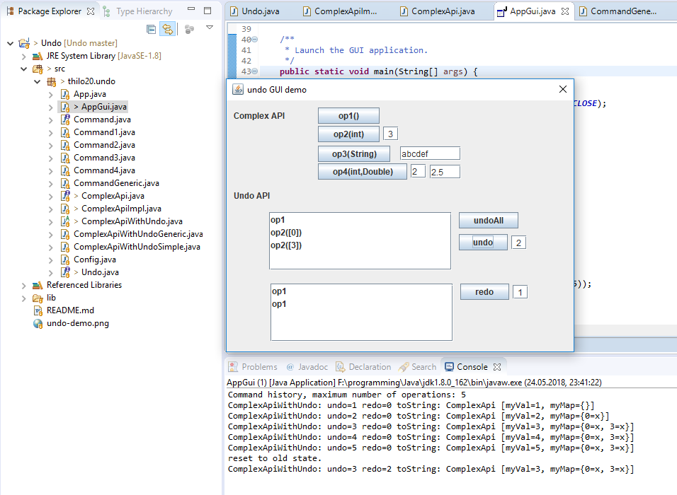

# Undo
This java demo project provides an example for an undo feature implementation.
It is realized by command pattern and delayed execution.
There is no need to implement a symmetric undo for every method in the API below.
Instead, a second instance of the API is used.

I recommend this forum thread to get started: 
https://stackoverflow.com/questions/49755/design-pattern-for-undo-engine

The screenshot below shows:
- project class layout 
- simple GUI for interactive testing

## how to use:
- Use buttons 'operation 1' and 'operation 2'(int) etc. to trigger commands of the base API.
- Observe command history undo/redo lists
- Use buttons 'undo' and 'redo' to revoke selected number of operations (core feature)
- Observe internal state in console window

## dev-env:
Simple Eclipse build, just import project, build and run.

development state: stable, fully functional

project stats: LoC=573 comment=199 files=15 
